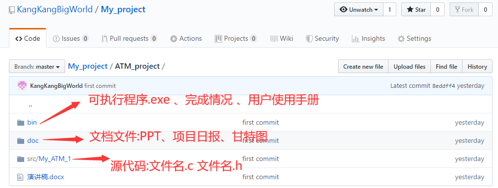
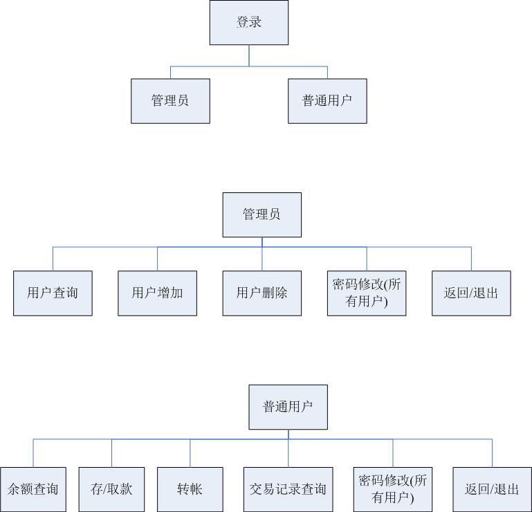
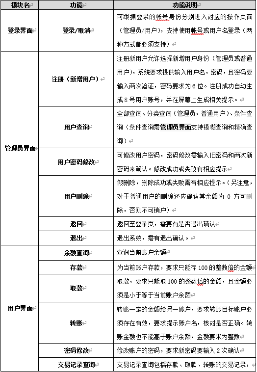
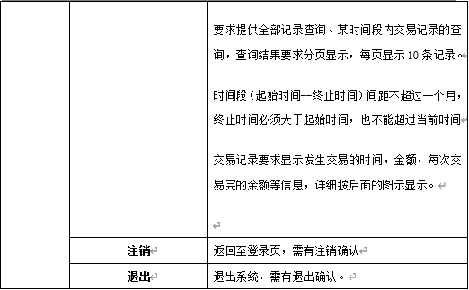
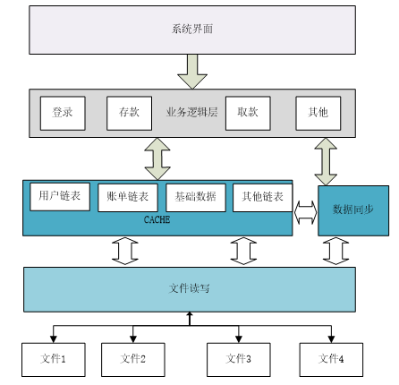
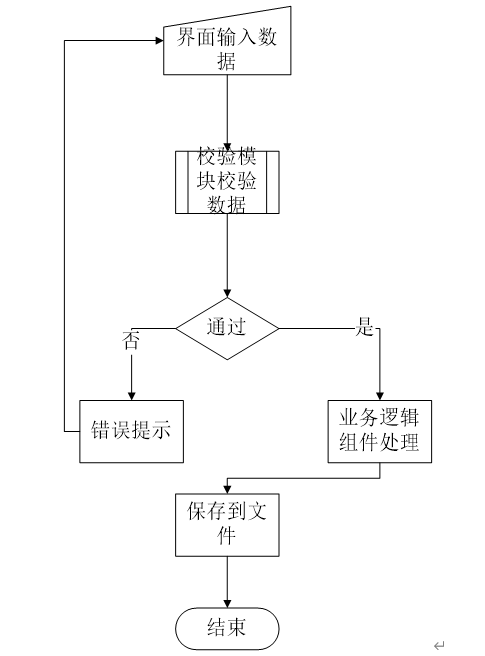

# ATM项目

## (项目效果详见\bin下的用户手册文件)

## 一、项目介绍

​    ATM是为银行用户提供方便快捷的存取款于一体的应用系统，主要包括三个部分的内容：

1、用户模块（实现对账户进行存取款和查询） 

2、系统管理员模块(基础数据的维护) 

3、统计分析模块(营业数据的分析和汇总) 

→ 顺利的完成对高校所学习的C语言的基础知识的巩固。

→掌握了指针结构体以及链表的应用。

→ 掌握了C语言对文件的操作。

→掌握了C语言多文件的应用。

语言：C语言

系统：win10

编译器（软件）：Visual C++ 6.0

#### 开发周期

| **阶段名称** | **占用时间** |
| ------------ | ------------ |
| 项目规划     | 0.5天        |
| 系统设计     | 0.5天        |
| 系统开发     | 5天          |
| 项目总结     | 1天          |

### 目录结构

## 二、功能性需求

###   1.系统用例

​																				图1 系统用例图

### 2.功能汇总

## 三、系统架构

### 1.概述

​	为了建立一个适度松散偶合的系统，系统做了层次的划分。系统分两层：下面一层描述了一个业务支撑的模块集合（包括cache 文件读写，数据同步）上层主要是ATM系统的应用开发。系统应用分视图层和业务组件（系统暂时不划分控制层）。

### 2.架构图

### 3.架构说明

※ 系统界面

系统界面存放各业务界面模块，每个界面对应一组.H和.C文件。

例如 VIEW_Login.h、VIEW_Login.c VIEW标志其属于UI层。

※业务逻辑层

业务逻辑层包含各种业务逻辑组件。例如登陆的业务逻辑组件LOGIC_Login.h、LOGIC_Login.c，LOGIC标志其属于业务逻辑层组件。

※ CACHE

CACHE层重要是包含文件中的各种数据的缓冲，便于业务层快速的对数据进行访问，包含各种链表。

※ 数据同步

数据同步组件维护着文件和CACHE中链表数据的一致。业务层调用同步组件将数据写入文件。

※文件读写

封装了对文件的读写操作。

## 四、部分模块设计

### 1.通用模块设计

#### 1.1概述

​	通用模块和系统的业务没有关系,具有一定的独立性,可以在不同的系统中重复的被使用.本系统的通用模块包含两块,一块是数据校验模块另外一块是文件读写模块.

### 2.校验模块设计

#### 2.1概述

​	校验模块系统了对输入数据的合法性验证,校验模块包含了基本的验证包括（字符串，数字，日期 等）。校验保证了系统数据的干净以及提供了友好的错误提示。

