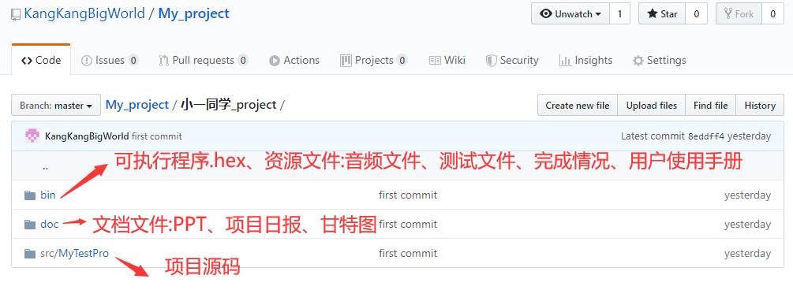
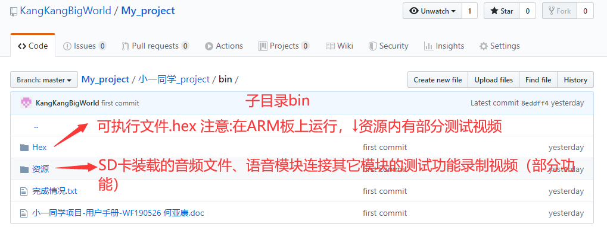
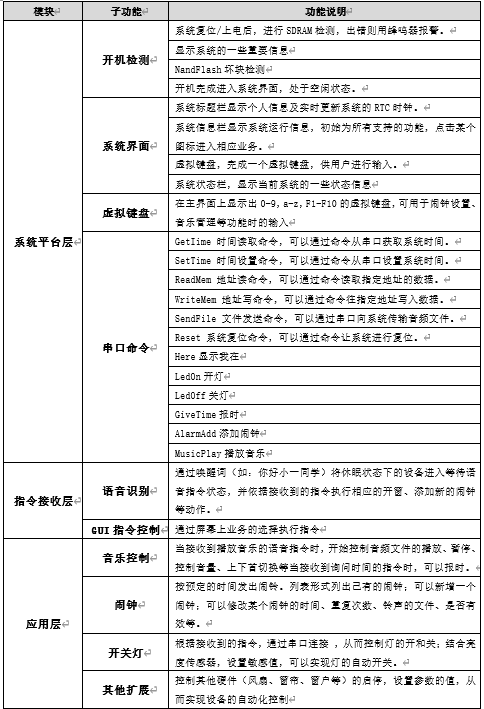
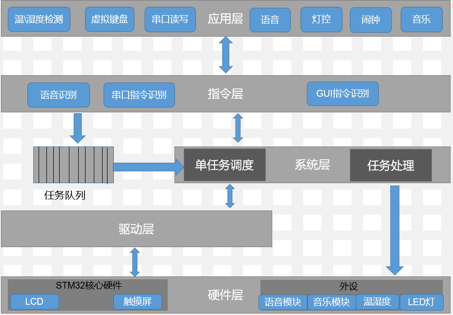

# 小一同学项目

## [项目效果详见\bin下的用户手册文件](./bin/用户手册.doc)

## [或者\bin\资源\使用教学视频(自测文档)tip：仅提供部分效果视频](./bin/资源/教学视频（自测文档）)

## 一、项目介绍

​    本产品为采用STM32开发板为硬件的简易型单任务操作系统，通过1个月《物联网传感器和通讯技术编程》知识的学习后，己经掌握了ARM系统启动，STM32下系统时钟，中断体系，定时器及各种外部设备的驱动的开发能力，并掌握了各种硬件体系的功能接口封装设计能力，但各个知识点是以相对零散的方式进行学习，通过这个知识体系的学习后，需要采用一个实战项目将这些知识进行综合应用，将所学知识升华到技能的状态，融会贯通，并且积累实际的项目开发经验，学生学会如何通过体系结构设计将所学的知识结合起来，形成一个产品的形态。

语言：C语言

系统：win10

编译器（软件）：uVision4(ARM版和C51版)、Jlink、

#### 开发周期

项目开发的总周期为10自然日，具体几个阶段的开发时间分配如下：

| **阶段名称** | **占用时间** |
| ------------ | ------------ |
| 项目需求     | 1天          |
| 进度规划     | 1天          |
| 系统设计     | 2天          |
| 项目编码     | 5天          |
| 项目总结     | 1天          |

l 项目需求：需求分析，理解以及同类型项目的UI鉴赏

l 进度规划：分析项目业务逻辑以及进度规划

l 系统设计：绘制项目核心流程图

l 项目编码：代码的实现

l 项目总结：评审结项会、评审PPT

### 目录结构

## 二、功能性需求

### 1.功能汇总

## 三、系统架构

### 1.架构图

