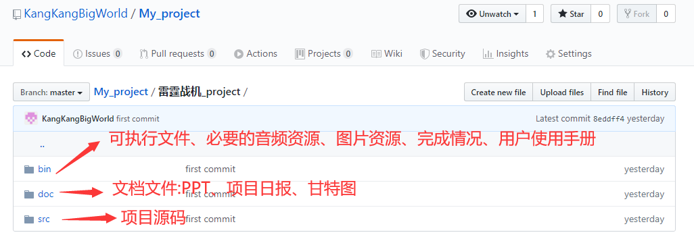

# 雷霆战机项目

## [项目效果详见\bin下的用户手册文件](./bin/用户使用手册.docx)

## 一、项目介绍

​    雷霆战机是一款飞行射击游戏，实现敌我双方，飞机互为攻防的模式，其中涉及我方飞机，敌方飞机，生命值，子弹等一些游戏元素。主要涉及到两方游戏元素的运动和运动碰撞。
​         雷霆战机系统设计主要是在 C++阶段对整体知识的系统化应用，掌握 QT 界面设计，巩固面向对象的编程思想，达到进一步巩固 C/C++语言知识，更能熟练使用 C++类的封装，继承和多态的使用， sqlite3 数据库的使用  

语言：C++

系统：win10

编译器（软件）：QT,sqlite_3

#### 开发周期

项目开发的总周期为 10 自然日，具体几个阶段的开发时间分配如下：  

| 阶段名称 | 占用时间 |
| -------- | -------- |
| 项目规划 | 1 天     |
| 系统设计 | 1 天     |
| 系统开发 | 7 天     |
| 项目总结 | 1 天     |

### 目录结构

## 二、功能性需求

### 1.功能汇总

| 模块名   | 功能                      | 功能说明                                                     |
| -------- | ------------------------- | ------------------------------------------------------------ |
| 网络模块 | 系统设置                  | 配置服务的 ip 地址与端口等设置。 配置成功之后进入 登录注册模块。 |
| 登陆注册 | 用户的登录和 新用户的注册 | 新用户注册：用户名、密码要求按一定规则进行输入 控制（用户名最长 12 个字符，可中文可英文，密码最 长 8 位字符，只能是数字，用户名密码不能为空） 用户不能重复注册 注册用户的信息存储到服务器的数据库当中 用户登录：输入用户名和密码和服务器当中的用户列 表进行匹配登陆 登录成功返回用户姓名，以及登录时间，界面显示欢 迎信息（ 欢迎 XXX） 密码提示问题功能，在注册用户、忘记密码中使用 |

| 功能选择界面 | 开始游戏/设 置/排行榜/帮 助/退出 | 开始游戏：进入游戏界面，开始游戏 设置：背景音乐开关、选择游戏难度（变化敌机数量）、 初始 NPC 模型（选择不同的飞机图片）， 新手指引开 关（允许在设置中关闭新手引导） 游戏难度（同屏中的飞机数量）： 初级： 1-2 中级： 4-5 高级： 5-10 帮助：游戏操作说明 退出：退出游戏，向服务器发送当前系统时间， 并对 游戏时长的进行打印。 |
| ------------ | -------------------------------- | ------------------------------------------------------------ |
| 游戏界面     | 游戏启动                         | 新手指引：判断是否第一次进入游戏，进行游戏功能 指引（新手指引中需说明游戏的操作方法，包括鼠标 操作和键盘操作） 我方飞机要求同时支持键盘和鼠标控制 倒计时：如果不是第一次，有进行 3S 倒计时游戏开始 敌方飞机：敌方飞机按照一定规则移动。 飞机的特征： 不同飞机不同的特征，不同血量，就是 类别不同。 飞机的损毁：血量为 0，或者检测碰撞，从地图爆炸 消失（敌我双方碰撞损毁，游戏结束） 炮弹：炮弹轨迹，炮弹伤害等 炮弹发射：敌机炮弹自动发射，我方飞机的炮弹仅在 操作鼠标左键或键盘上定义的“发射”键时发射 提供游戏的暂停和继续按钮 游戏结束：我方飞机损毁，游戏结束显示排行榜，记 录分数到排行榜 |
| 排行榜数据   | 排行榜                           | 游戏所得分分数存入数据库进行存储和显示。 排行榜显示内容包括：排名、用户名、得分 每页最多显示 10 条记录 排行榜支持分页显示，支持翻页功能 |

